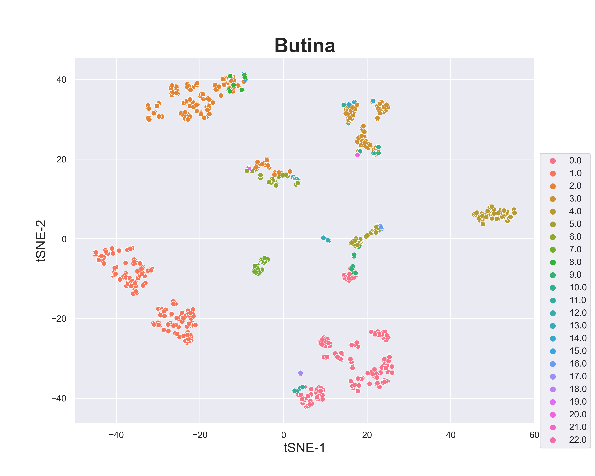
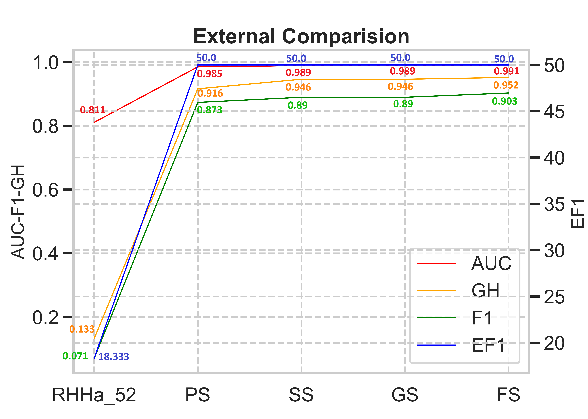

# KSE-BCB2023-Pharmacophore

## ***In silico*** **study: Combination of Butina algorithm and stacking method for Pharmacophore model development**

**Abstract**
A 3D pharmacophore model describes ligand interactions chemically in their bioactive conformation. They offer a simple but elegant method to decipher chemically encoded ligand information, making them a valuable tool in drug design. Our review summarizes key studies for applying 3D pharmacophore models in virtual screening for APJ receptor agonists. Recent advances in clustering algorithms and ensemble methods have enabled classical pharmacophore modeling to evolve into more flexible and knowledge-driven techniques. Butina clustering categorizes molecules based on their structural similarity (indicated by the Tanimoto coefficient) to create structure diversity in the training dataset. The ensemble stacking method combines single pharmacophore models into a set of pharmacophore models to optimize pharmacophore space in virtual screening. This approach was evaluated on Apelin datasets and afforded good screening performance, as measured by receiver operating characteristic, enrichment factor, Güner-Henry score, and F-measure. Although one of the high-scoring models achieved superior statistical results in each dataset, the ensemble Stacking method balanced the shortcomings of each model and passed with close performance measures

Keywords: 3D pharmacophore model, APJ receptor agonist, Butina clustering algorithm, Ensemble stacking method

## Description

### Butina clustering
Butina clustering was implemented to identify smaller but homogeneous clusters, with the prerequisite that (at least) the cluster centroid would be more similar than a given threshold to every other molecule in the cluster.

### Automated validation
The process of developing a pharmacophore model was conducted in MOE2015.10. Firstly, the possible conformations for each structure were initialized by 
calculating the low-energy conformations of a set of molecules. Then, the conformations were used to generate pharmacophore queries that have good overlap in most of the actives and are separated from the inactive ones. The next step was “Global Search validation” (Automated pipeline tovalidate hundreds of pharmacophore models) by finding hits that were active and inactive by the Pharmacophore Search inMOE. The final results were automatically assessed by Python script.

### Optimization
The study introduced the "Global Stacking" technique, which is an adaptation of David's Stacking algorithm from 
"Stacked generalization" in 1992, applied specifically to Pharmacophore models. Stacking combines predictions from multiple models on the same data set. The Stacking model is usually divided into two levels: level-0 modes and level-1 models. Level-0 Models (Base-Models), learn directly from the dataset and make predictions for the level-1 model. And level-1 Model (Meta-Model) learns from the predictions of the base model (level-0)

# Contributors
- [Xuan-Truc Tran Dinh](https://github.com/XuanTruc810) 
- [Tieu-Long Phan](https://tieulongphan.github.io/)
- [Ngoc-Tuyen Truong](https://scholar.google.com/citations?hl=vi&user=qx3eMsIAAAAJ) - [Corresponding author](mailto:truongtuyen@ump.edu.vn)